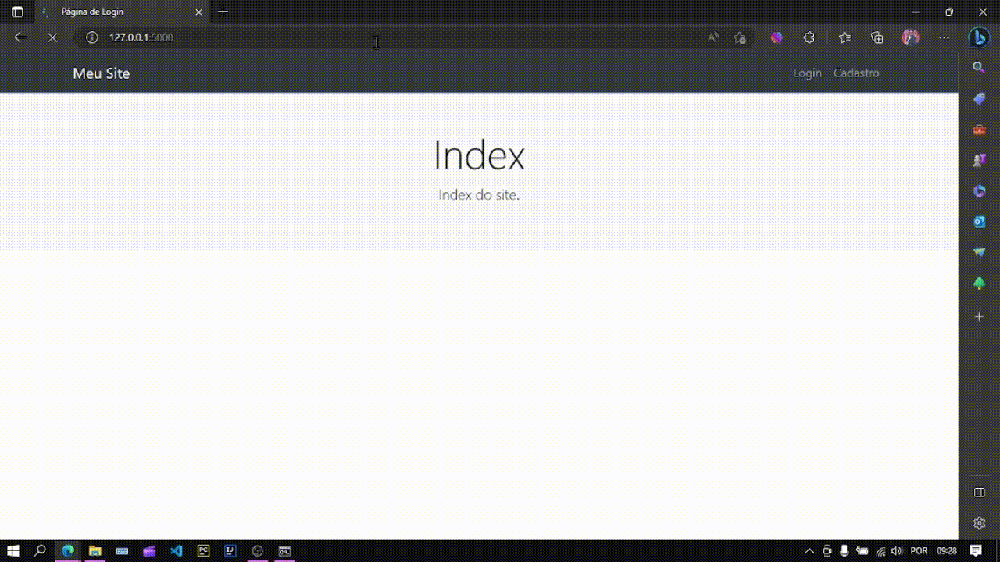
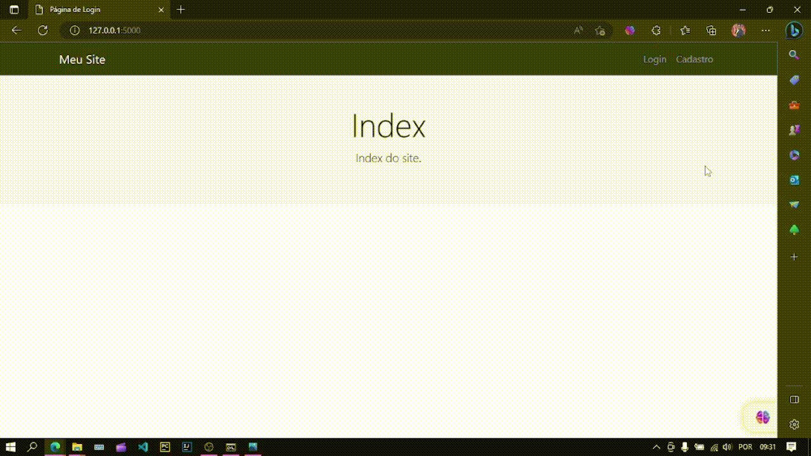
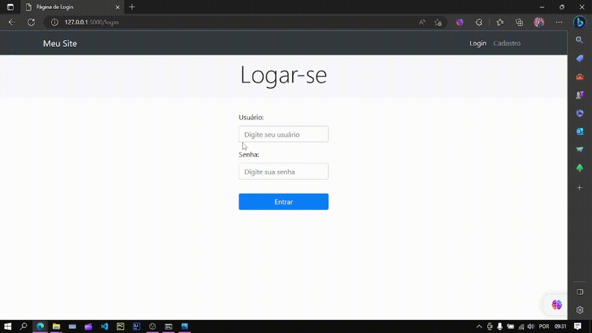

# CRUD com HTML em Flask

Sistema CRUD HTML desenvolvido em FLASK, com direito a controle de sessão, cadastro, login, painel de admin, edição e remoção de usuarios.

##

## Funcionalidades Ativas: 

### Cadastro

> Adriel Rosa (update 26/03/2023  11:00 PM)

### Login

> Adriel Rosa (update 26/03/2023  11:00 PM)

### Login painel admin

> Adriel Rosa (update 26/03/2023  11:00 PM)

##

 ## Tecnologias:
 - HTML
 - CSS
 - Python
 - Framework Python: 
   - Flask
   - SQLAlchemy
   - jinja2
   - werkzeug
 - Sqlite3
 - Git & GitHub
 
 ## Contato:
 
 - E-mail: adrielrosa@live.com 
 - LinkedIn: https://www.linkedin.com/in/adriel-rosa-660431144/
